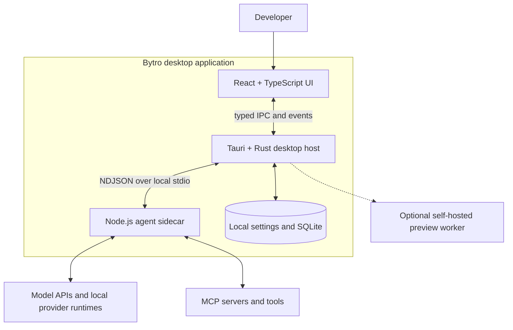

<p align="center">
  
</p>

<h1 align="center">Bytro Community Edition</h1>

<p align="center"><strong>One local workspace for every coding agent.</strong></p>

<p align="center">
  Bring models, conversations, project files, terminals, Git, MCP, skills, and
  multi-agent workflows together in one desktop app.
</p>

<p align="center">
  <strong>English</strong> · <a href="./README.zh-CN.md">简体中文</a>
</p>

<p align="center">
  <a href="./LICENSE"></a>
  
  
  
</p>

Bytro is a local-first desktop workspace for AI-assisted development. Configure
your own providers, keep project context and settings on your machine, and move
from a question to code, terminal output, Git review, or a working preview
without switching tools.

## Why Bytro?

|                               |                                                                                                                       |
| ----------------------------- | --------------------------------------------------------------------------------------------------------------------- |
| **One workspace**             | Chat, browse files, edit code, inspect diffs, run terminals, manage Git, and preview projects without losing context. |
| **Your models and endpoints** | Use user-configured Claude, Codex/OpenAI, Gemini, OpenAI-compatible, or local Ollama workflows.                       |
| **Local-first state**         | Conversations, workspace state, model profiles, MCP configuration, and API settings persist locally across restarts.  |
| **Built for agentic work**    | Review tool calls, reuse skills, connect MCP servers, and coordinate multiple agents from the same project.           |

## Highlights

- **Multi-provider conversations** — stream responses from hosted APIs, custom
  compatible endpoints, and supported local provider runtimes.
- **Complete project workspace** — file tree, editor, search, diffs,
  checkpoints, code review, and project-aware context.
- **Integrated development tools** — PTY terminals, development-server
  detection, local previews, and Git workflows from status to push.
- **MCP and reusable skills** — persist user MCP configuration, discover
  project or user skills, and invoke slash commands.
- **Multi-agent collaboration** — create teams, route tasks, follow live
  status, and receive agent messages in one place.
- **Bring your own configuration** — save API keys, custom base URLs, model
  names, proxies, and supported provider profiles.
- **Optional publishing** — keep previews local or connect an independently
  deployed site-preview Worker.

## Quick Start

### Prerequisites

- [Node.js](https://nodejs.org/) 20.19+ or 22.12+
- npm 10 or newer
- Rust stable
- Git
- The prerequisites for your platform from the
  [Tauri 2 guide](https://v2.tauri.app/start/prerequisites/)

### Run from source

From a checkout of this repository:

```bash
cd bytro-community
npm ci
npm --prefix sidecar ci
npm run tauri dev
```

The Tauri development hook builds the local Sidecar, starts Vite on port
`1420`, and launches the desktop application.

> [!NOTE]
> Bytro Community Edition is currently pre-release. Build it from source and
> review the [security](./SECURITY.md) and [privacy](./PRIVACY.md) notes before
> using it with sensitive repositories or production credentials.

## Configure a Model

1. Open Bytro and go to model configuration.
2. Create or import a supported provider profile.
3. Enter the exact model name and, when needed, your API key and base URL.
4. Test the profile, then select it from the conversation composer.

User-saved model profiles, API keys, base URLs, proxies, and MCP configuration
persist in Bytro's local application data after restart.

For Claude and Codex sessions, Bytro prepares the required platform package
with the local Node.js/npm toolchain when it is missing. Package versions are
pinned by [`sidecar/package.json`](./sidecar/package.json), and the private
runtime is stored under `~/.bytro-community/cli`. Startup preparation is
best-effort and is retried when a session requires the runtime.

Provider authentication, quota, billing, and service terms remain those of the
provider you configure. See [Provider Configuration](./docs/PROVIDERS.md) for
connection patterns and troubleshooting.

## Architecture



The React frontend owns presentation and interaction. Privileged filesystem,
Git, PTY, database, and operating-system work passes through the Rust/Tauri
host. Provider sessions, streaming, tools, MCP, skills, and teams are isolated
in a restartable local Node.js Sidecar.

Read [Architecture](./docs/ARCHITECTURE.md) for process boundaries, request
flow, storage, and failure behavior.

## Local Data and Privacy

Bytro keeps its application state in operating-system application-data
locations and the user-owned `~/.bytro-community` directory. This includes:

- conversations and workspace state;
- model profiles, API keys, custom endpoints, and proxy settings;
- MCP server configuration and managed skills; and
- provider runtime paths and local diagnostics.

Saved credentials currently persist unencrypted and are not protected by the
operating system's credential vault. Protect your OS account, use
least-privilege keys, and never commit credentials to a project.

Bytro connects to the network when a configured workflow or runtime setup
requires it. Destinations can include the npm registry used to prepare pinned
Claude/Codex packages, a model endpoint, Git remote, MCP server, or optional
preview Worker. Review [Privacy](./PRIVACY.md),
[Network and Data](./docs/NETWORK_AND_DATA.md), and
[Runtime Configuration](./docs/CONFIGURATION.md) before using sensitive data.

## Development

| Command                 | Purpose                                |
| ----------------------- | -------------------------------------- |
| `npm run build:sidecar` | Build the local Node.js Sidecar bundle |
| `npm run build`         | Type-check and build the frontend      |
| `npm test`              | Run frontend tests                     |
| `npm run test:sidecar`  | Run Sidecar tests                      |
| `npm run check:rust`    | Check the Rust/Tauri crate             |
| `npm run tauri build`   | Create a local platform package        |

After installing the optional preview Worker dependencies, run the complete
source validation gate:

```bash
npm --prefix services/site-preview-worker ci
npm run ci:gate
```

See [Building from Source](./docs/BUILDING.md) for platform packaging,
validation, and dependency-review details.

## Repository Layout

```text
.
├── src/                         # React application
├── src-tauri/                   # Rust/Tauri desktop host
├── sidecar/                     # Local Node.js agent runtime
├── resources/                   # Runtime and build resources
├── services/
│   └── site-preview-worker/     # Optional self-hosted preview service
└── docs/                        # Architecture and operations guides
```

## Documentation

- [Architecture](./docs/ARCHITECTURE.md)
- [Building from Source](./docs/BUILDING.md)
- [Provider Configuration](./docs/PROVIDERS.md)
- [Runtime Configuration](./docs/CONFIGURATION.md)
- [Network and Data](./docs/NETWORK_AND_DATA.md)
- [Privacy](./PRIVACY.md)
- [Security](./SECURITY.md)
- [Support](./SUPPORT.md)

## Contributing

Contributions are welcome. Start with [CONTRIBUTING.md](./CONTRIBUTING.md),
follow the [Code of Conduct](./CODE_OF_CONDUCT.md), keep changes focused, and
include tests or documentation when behavior changes.

## Security

Bytro can read project files, execute tools, launch local processes, and send
selected context to configured providers. Treat it as a high-privilege
developer application. Report vulnerabilities privately according to
[SECURITY.md](./SECURITY.md).

## License

The project code is licensed under the
[Apache License 2.0](./LICENSE). Third-party components retain their own
licenses; see [THIRD_PARTY_NOTICES.md](./THIRD_PARTY_NOTICES.md) and
[NOTICE](./NOTICE).
