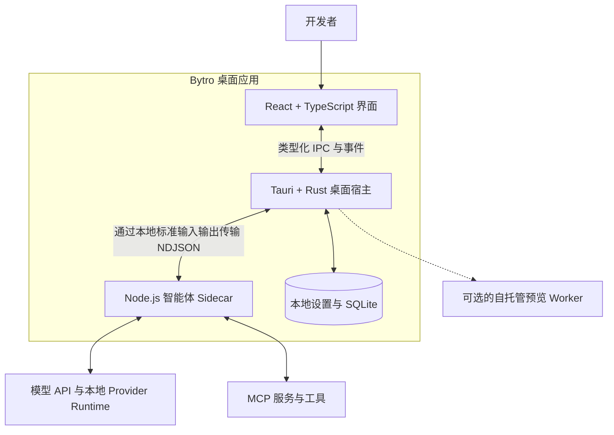

<p align="center">
  
</p>

<h1 align="center">Bytro Community Edition</h1>

<p align="center"><strong>一个面向所有编程智能体的本地工作空间。</strong></p>

<p align="center">
  在一个桌面应用中统一管理模型、对话、项目文件、终端、Git、MCP、Skills
  和多智能体工作流。
</p>

<p align="center">
  <a href="./README.md">English</a> · <strong>简体中文</strong>
</p>

<p align="center">
  <a href="./LICENSE"></a>
  
  
  
</p>

Bytro 是一个面向 AI 辅助开发的本地优先桌面工作空间。你可以配置自己的模型服务，
将项目上下文和设置保留在本机，并在同一个应用中完成提问、代码修改、终端操作、
Git 审查和项目预览。

## 为什么选择 Bytro？

|                          |                                                                                                              |
| ------------------------ | -------------------------------------------------------------------------------------------------------------- |
| **统一的工作空间**       | 对话、文件、编辑器、差异、终端、Git、预览共享同一个项目根目录——智能体的改动、你的终端和 diff 视图始终一致。 |
| **内置 11 家模型服务**   | Claude、Codex、Gemini、DeepSeek、通义千问、智谱、Kimi、MiniMax、小米 MiMO、Ollama，以及任意 OpenAI 兼容端点。 |
| **本地优先的状态管理**   | 对话、工作区状态、模型配置、MCP 配置和 API 设置都存在你自己的磁盘上，重启后仍在。                             |
| **每一步操作你说了算**   | 工具调用在执行前展示并由你批准/拒绝；检查点可回滚智能体对文件的修改。                                         |

### 内置模型服务

| 服务商       | 厂商      | 默认 Base URL                                       |
| ------------ | --------- | --------------------------------------------------- |
| **Claude**   | Anthropic | `https://api.anthropic.com`                         |
| **Codex**    | OpenAI    | `https://api.openai.com/v1`                         |
| **Gemini**   | Google    | *(SDK 默认)*                                        |
| **DeepSeek** | 深度求索  | `https://api.deepseek.com`                          |
| **Qwen**     | 阿里云    | `https://dashscope.aliyuncs.com/compatible-mode/v1` |
| **BigModel** | 智谱      | `https://open.bigmodel.cn/api/paas/v4`              |
| **Kimi**     | 月之暗面  | `https://api.kimi.com/coding/`                      |
| **MiniMax**  | MiniMax   | `https://api.minimaxi.com/v1`                       |
| **MiMO**     | 小米      | `https://api.xiaomimimo.com/v1`                     |
| **Ollama**   | 本地      | `http://localhost:11434`                            |

Base URL 已预填，可自行覆盖。详见[模型服务配置](./docs/PROVIDERS.md)。

## 核心功能

- **多模型对话**——从云端 API、自定义兼容端点和受支持的本地 Provider
  Runtime 获取流式响应。
- **完整的项目工作区**——文件树、编辑器、搜索、差异、检查点、代码审查和项目上下文。
- **集成开发工具**——PTY 终端、开发服务器检测、本地预览，以及从状态检查到推送的
  Git 工作流。
- **MCP 与可复用 Skills**——持久化用户 MCP 配置，发现项目或用户 Skills，
  并执行斜杠命令。
- **多智能体协作**——创建团队、分配任务、跟踪实时状态并集中接收智能体消息。
- **自带模型配置**——保存 API Key、自定义 Base URL、模型名称、代理和受支持的
  Provider 配置。
- **可选的站点发布**——使用纯本地预览，或连接由你独立部署的站点预览 Worker。

## 快速开始

### 前置要求

- [Node.js](https://nodejs.org/) 20.19+ 或 22.12+
  （仅当你要构建或校验可选的预览 Worker 时**必须 22.12+**）
- npm 10 或更高版本
- Rust stable
- Git
- [Tauri 2 指南](https://v2.tauri.app/start/prerequisites/)中对应平台的依赖

### 从源码运行

```bash
git clone https://github.com/foodmade/bytro-code.git
cd bytro-code
npm ci
npm --prefix sidecar ci
npm run tauri dev
```

Tauri 的开发钩子会构建本地 Sidecar，在 `1420` 端口启动 Vite，并拉起桌面应用。
首次运行还需要编译 Rust 宿主，会花上几分钟。

遇到问题？见[故障排查](./docs/TROUBLESHOOTING.md)。

> [!NOTE]
> Bytro Community Edition 目前处于预发布阶段。请从源码构建，并在用于敏感仓库或
> 生产环境凭证之前阅读[安全说明](./SECURITY.md)和[隐私说明](./PRIVACY.md)。

## 配置模型

1. 打开 Bytro，进入模型配置。
2. 新建或导入受支持的 Provider 配置。
3. 填写准确的模型名称，并按需填写 API Key 和 Base URL。
4. 测试配置，然后在对话输入区选择该模型。

用户保存的模型配置、API Key、Base URL、代理和 MCP 配置会持久化到 Bytro
的本地应用数据中，应用重启后仍然可用。

对于 Claude 和 Codex 会话，如果当前平台所需的运行包不存在，Bytro 会使用本机的
Node.js/npm 工具链进行准备。包版本固定在
[`sidecar/package.json`](./sidecar/package.json) 中，私有运行目录位于
`~/.bytro-community/cli`。启动时会尽力提前完成准备；如果失败，实际会话需要该
运行环境时还会再次尝试。

身份认证、额度、计费和服务条款由你配置的 Provider 决定。有关连接方式和故障排查，
请参阅 [Provider 配置](./docs/PROVIDERS.md)。

## 架构



React 前端只负责渲染界面，不直接接触文件系统。文件系统、Git、PTY、数据库和
操作系统相关的高权限操作都经由 Rust/Tauri 宿主。Provider 会话、流式响应、工具、
MCP、Skills 和团队功能运行在独立的 Node.js 进程中——模型流崩溃不会拖垮整个应用。

有关进程边界、请求流程、存储和失败处理的详细说明，请参阅
[架构文档](./docs/ARCHITECTURE.md)。

## 概念说明

本项目和界面中会反复出现的几个术语：

- **Sidecar**——运行所有 Provider 会话的 Node.js 子进程，可重启，与桌面外壳隔离。
- **MCP（Model Context Protocol）**——把外部工具暴露给模型的开放标准。Bytro
  可连接任何你配置的 MCP 服务。
- **Skill**——一个可复用的提示词与说明文件夹，按项目或用户发现，通过斜杠命令调用。
- **Team（团队）**——多个智能体协作同一个项目，任务自动路由并共享实时状态。
- **Checkpoint（检查点）**——智能体修改文件前对工作区拍下的快照，可随时回滚。
- **PTY**——真正的伪终端，交互式命令行程序的行为与你自己的终端完全一致。

## 本地数据与隐私

Bytro 将应用状态保存在操作系统的应用数据目录和用户拥有的
`~/.bytro-community` 目录中，其中包括：

- 对话和工作区状态；
- 模型配置、API Key、自定义端点和代理设置；
- MCP 服务配置和 Bytro 管理的 Skills；
- Provider 运行路径和本地诊断信息。

当前保存的凭证会以未加密形式持久化，尚未接入操作系统的凭证保险库。请保护好操作
系统账户、使用最小权限的 Key，并且不要将凭证提交到项目仓库。

当已配置的工作流或运行环境准备需要时，Bytro 会连接网络。访问目标可能包括用于
准备固定版本 Claude/Codex 运行包的 npm Registry、模型端点、Git 远端、MCP
服务或可选的预览 Worker。在处理敏感数据前，请阅读[隐私说明](./PRIVACY.md)、
[网络与数据](./docs/NETWORK_AND_DATA.md)和[运行配置](./docs/CONFIGURATION.md)。

## 开发

| 命令                    | 用途                     |
| ----------------------- | ------------------------ |
| `npm run build:sidecar` | 构建本地 Node.js Sidecar |
| `npm run build`         | 类型检查并构建前端       |
| `npm test`              | 运行前端测试             |
| `npm run test:sidecar`  | 运行 Sidecar 测试        |
| `npm run check:rust`    | 检查 Rust/Tauri crate    |
| `npm run tauri build`   | 创建当前平台的本地安装包 |

安装可选的预览 Worker 依赖后，可以运行完整的源码验证流程：

```bash
npm --prefix services/site-preview-worker ci
npm run ci:gate
```

有关平台打包、验证和依赖审查的详细说明，请参阅
[从源码构建](./docs/BUILDING.md)。

## 项目结构

```text
.
├── src/                          # React 前端
│   ├── main.tsx                  #   入口
│   ├── App.tsx                   #   根布局与路由
│   ├── stores/                   #   Zustand 状态
│   ├── components/               #   功能界面（chat、git、terminal、teams、skills…）
│   └── lib/platform-config.ts    #   内置模型服务与型号清单
├── src-tauri/                    # Rust/Tauri 桌面宿主
│   ├── lib.rs                    #   Tauri 入口与命令注册
│   ├── sidecar/                  #   Sidecar 生命周期与 NDJSON 桥接
│   ├── provider_cli.rs           #   Claude/Codex 运行时解析与安装
│   ├── git/  pty.rs  memory/     #   高权限系统操作
├── sidecar/src/                  # Provider 适配器、MCP、Skills、团队
│   ├── claude-handler.ts         #   Claude Agent SDK
│   ├── openai-handler.ts         #   Codex App Server
│   └── chatcmpl-handler.ts       #   OpenAI 兼容端点（DeepSeek/Qwen/Ollama…）
├── services/site-preview-worker/ # 可选的自托管预览服务
└── docs/                         # 架构与运维文档
```

**从哪里开始读**：想理解一条消息从回车到模型的完整路径，依次看
`src/components/chat/chat-panel.tsx` →
`src-tauri/src/sidecar/mod.rs` → `sidecar/src/index.ts`。

## 文档

**上手**

- [故障排查](./docs/TROUBLESHOOTING.md)——首次运行常见问题与日志收集
- [模型服务配置](./docs/PROVIDERS.md)——接入模型、Base URL、运行时解析
- [从源码构建](./docs/BUILDING.md)——打包与验证
- [运行配置](./docs/CONFIGURATION.md)——环境变量与路径

**深入了解**

- [架构](./docs/ARCHITECTURE.md)——进程边界与请求流程
- [社区版包含什么](./docs/COMMUNITY_EDITION.md)——能力对照表
- [网络与数据](./docs/NETWORK_AND_DATA.md)——全部对外访问目标
- [更新日志](./CHANGELOG.md)

**政策**

- [隐私](./PRIVACY.md) · [安全](./SECURITY.md) · [支持](./SUPPORT.md) · [商标](./TRADEMARKS.md)
- [预览 Worker 指南](./services/site-preview-worker/README.md)——可选的自托管发布

## 参与贡献

欢迎参与贡献。请从 [CONTRIBUTING.md](./CONTRIBUTING.md) 开始，遵守
[行为准则](./CODE_OF_CONDUCT.md)，保持修改范围聚焦，并在行为发生变化时补充测试
或文档。

## 安全

Bytro 可以读取项目文件、执行工具、启动本地进程，并将选定的上下文发送给已配置的
Provider。请将它视为高权限开发工具，并按照 [SECURITY.md](./SECURITY.md)
中的说明私下报告安全漏洞。

## 许可证

项目代码使用 [Apache License 2.0](./LICENSE) 许可。第三方组件保留各自的许可证；
详见 [THIRD_PARTY_NOTICES.md](./THIRD_PARTY_NOTICES.md) 和
[NOTICE](./NOTICE)。
