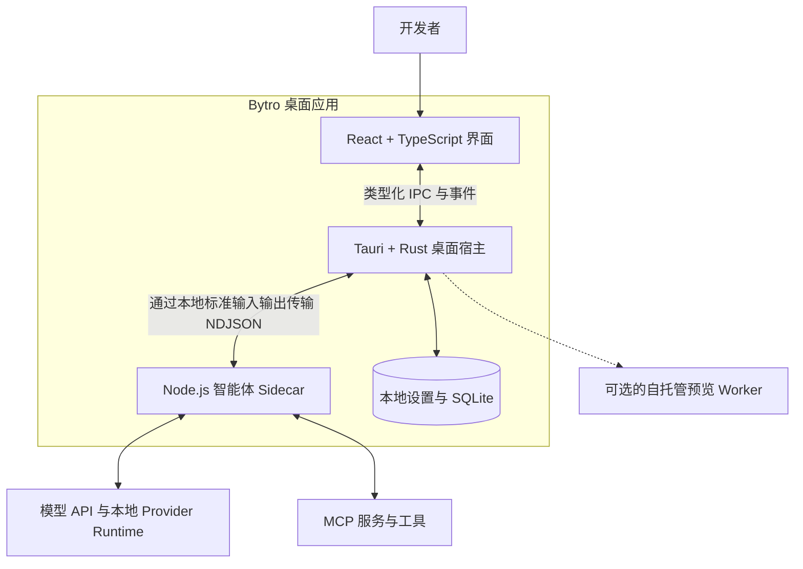

<p align="center">
  
</p>

<h1 align="center">Bytro Community Edition</h1>

<p align="center"><strong>一个面向所有编程智能体的本地工作空间。</strong></p>

<p align="center">
  在一个桌面应用中统一管理模型、对话、项目文件、终端、Git、MCP、Skills
  和多智能体工作流。
</p>

<p align="center">
  <a href="./README.md">English</a> · <strong>简体中文</strong>
</p>

<p align="center">
  <a href="./LICENSE"></a>
  
  
  
</p>

Bytro 是一个面向 AI 辅助开发的本地优先桌面工作空间。你可以配置自己的模型服务，
将项目上下文和设置保留在本机，并在同一个应用中完成提问、代码修改、终端操作、
Git 审查和项目预览。

## 为什么选择 Bytro？

|                          |                                                                                              |
| ------------------------ | -------------------------------------------------------------------------------------------- |
| **统一的工作空间**       | 在不丢失上下文的情况下完成对话、文件浏览、代码编辑、差异检查、终端操作、Git 管理和项目预览。 |
| **使用自己的模型和端点** | 使用用户配置的 Claude、Codex/OpenAI、Gemini、OpenAI 兼容服务或本地 Ollama 工作流。           |
| **本地优先的状态管理**   | 对话、工作区状态、模型配置、MCP 配置和 API 设置会在本地持久化，重启后仍可使用。              |
| **为智能体工作流而设计** | 在同一个项目中审查工具调用、复用 Skills、连接 MCP 服务并协调多个智能体。                     |

## 核心功能

- **多模型对话**——从云端 API、自定义兼容端点和受支持的本地 Provider
  Runtime 获取流式响应。
- **完整的项目工作区**——文件树、编辑器、搜索、差异、检查点、代码审查和项目上下文。
- **集成开发工具**——PTY 终端、开发服务器检测、本地预览，以及从状态检查到推送的
  Git 工作流。
- **MCP 与可复用 Skills**——持久化用户 MCP 配置，发现项目或用户 Skills，
  并执行斜杠命令。
- **多智能体协作**——创建团队、分配任务、跟踪实时状态并集中接收智能体消息。
- **自带模型配置**——保存 API Key、自定义 Base URL、模型名称、代理和受支持的
  Provider 配置。
- **可选的站点发布**——使用纯本地预览，或连接由你独立部署的站点预览 Worker。

## 快速开始

### 前置要求

- [Node.js](https://nodejs.org/) 20 或更高版本
- npm 10 或更高版本
- Rust stable
- Git
- [Tauri 2 指南](https://v2.tauri.app/start/prerequisites/)中对应平台的依赖

### 从源码运行

在本仓库的代码目录中执行：

```bash
cd bytro-community
npm ci
npm --prefix sidecar ci
npm run tauri dev
```

Tauri 的开发钩子会构建本地 Sidecar，在 `1420` 端口启动 Vite，并拉起桌面应用。

> [!NOTE]
> Bytro Community Edition 目前处于预发布阶段。请从源码构建，并在用于敏感仓库或
> 生产环境凭证之前阅读[安全说明](./SECURITY.md)和[隐私说明](./PRIVACY.md)。

## 配置模型

1. 打开 Bytro，进入模型配置。
2. 新建或导入受支持的 Provider 配置。
3. 填写准确的模型名称，并按需填写 API Key 和 Base URL。
4. 测试配置，然后在对话输入区选择该模型。

用户保存的模型配置、API Key、Base URL、代理和 MCP 配置会持久化到 Bytro
的本地应用数据中，应用重启后仍然可用。

对于 Claude 和 Codex 会话，如果当前平台所需的运行包不存在，Bytro 会使用本机的
Node.js/npm 工具链进行准备。包版本固定在
[`sidecar/package.json`](./sidecar/package.json) 中，私有运行目录位于
`~/.bytro-community/cli`。启动时会尽力提前完成准备；如果失败，实际会话需要该
运行环境时还会再次尝试。

身份认证、额度、计费和服务条款由你配置的 Provider 决定。有关连接方式和故障排查，
请参阅 [Provider 配置](./docs/PROVIDERS.md)。

## 架构



React 前端负责界面展示和用户交互。文件系统、Git、PTY、数据库和操作系统相关的
高权限操作由 Rust/Tauri 宿主处理。Provider 会话、流式响应、工具、MCP、Skills
和团队功能被隔离在可重启的本地 Node.js Sidecar 中。

有关进程边界、请求流程、存储和失败处理的详细说明，请参阅
[架构文档](./docs/ARCHITECTURE.md)。

## 本地数据与隐私

Bytro 将应用状态保存在操作系统的应用数据目录和用户拥有的
`~/.bytro-community` 目录中，其中包括：

- 对话和工作区状态；
- 模型配置、API Key、自定义端点和代理设置；
- MCP 服务配置和 Bytro 管理的 Skills；
- Provider 运行路径和本地诊断信息。

当前保存的凭证会以未加密形式持久化，尚未接入操作系统的凭证保险库。请保护好操作
系统账户、使用最小权限的 Key，并且不要将凭证提交到项目仓库。

当已配置的工作流或运行环境准备需要时，Bytro 会连接网络。访问目标可能包括用于
准备固定版本 Claude/Codex 运行包的 npm Registry、模型端点、Git 远端、MCP
服务或可选的预览 Worker。在处理敏感数据前，请阅读[隐私说明](./PRIVACY.md)、
[网络与数据](./docs/NETWORK_AND_DATA.md)和[运行配置](./docs/CONFIGURATION.md)。

## 开发

| 命令                    | 用途                     |
| ----------------------- | ------------------------ |
| `npm run build:sidecar` | 构建本地 Node.js Sidecar |
| `npm run build`         | 类型检查并构建前端       |
| `npm test`              | 运行前端测试             |
| `npm run test:sidecar`  | 运行 Sidecar 测试        |
| `npm run check:rust`    | 检查 Rust/Tauri crate    |
| `npm run tauri build`   | 创建当前平台的本地安装包 |

安装可选的预览 Worker 依赖后，可以运行完整的源码验证流程：

```bash
npm --prefix services/site-preview-worker ci
npm run ci:gate
```

有关平台打包、验证和依赖审查的详细说明，请参阅
[从源码构建](./docs/BUILDING.md)。

## 项目结构

```text
.
├── src/                         # React 应用
├── src-tauri/                   # Rust/Tauri 桌面宿主
├── sidecar/                     # 本地 Node.js 智能体运行层
├── resources/                   # 运行时与构建资源
├── services/
│   └── site-preview-worker/     # 可选的自托管预览服务
└── docs/                        # 架构与运维文档
```

## 文档

- [架构](./docs/ARCHITECTURE.md)
- [从源码构建](./docs/BUILDING.md)
- [Provider 配置](./docs/PROVIDERS.md)
- [运行配置](./docs/CONFIGURATION.md)
- [网络与数据](./docs/NETWORK_AND_DATA.md)
- [隐私](./PRIVACY.md)
- [安全](./SECURITY.md)
- [支持](./SUPPORT.md)

## 参与贡献

欢迎参与贡献。请从 [CONTRIBUTING.md](./CONTRIBUTING.md) 开始，遵守
[行为准则](./CODE_OF_CONDUCT.md)，保持修改范围聚焦，并在行为发生变化时补充测试
或文档。

## 安全

Bytro 可以读取项目文件、执行工具、启动本地进程，并将选定的上下文发送给已配置的
Provider。请将它视为高权限开发工具，并按照 [SECURITY.md](./SECURITY.md)
中的说明私下报告安全漏洞。

## 许可证

项目代码使用 [Apache License 2.0](./LICENSE) 许可。第三方组件保留各自的许可证；
详见 [THIRD_PARTY_NOTICES.md](./THIRD_PARTY_NOTICES.md) 和
[NOTICE](./NOTICE)。
