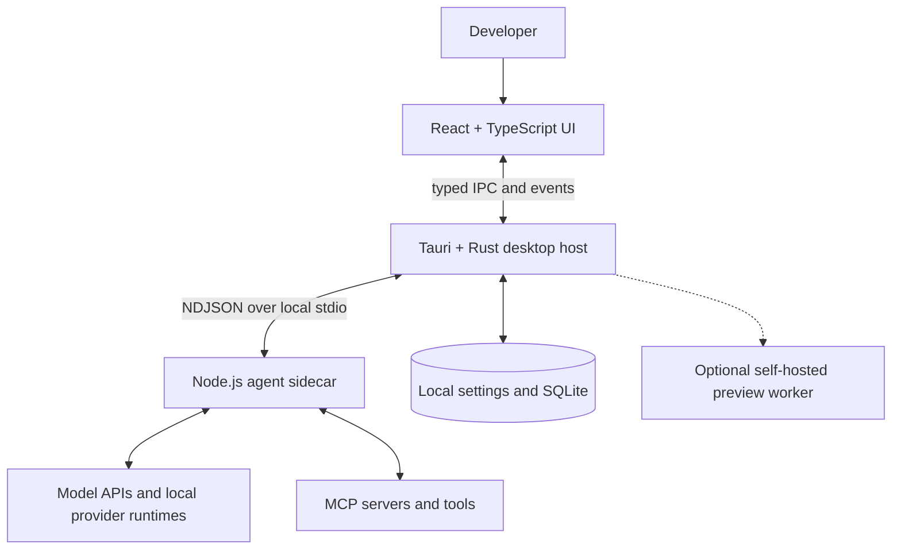

# Bilingual README Design

## Goal

Make the repository homepage immediately understandable and appealing to AI
developers who want to run Bytro locally. The default page is English, with a
prominent link to a complete Simplified Chinese version.

The README should answer four questions quickly:

1. What is Bytro?
2. Why would I use it?
3. How do I run it locally?
4. How is it put together?

## Files

- `README.md`: canonical English landing page.
- `README.zh-CN.md`: complete Simplified Chinese mirror.

Both files begin with the same language selector:

```text
English | 简体中文
```

Each language label links to the corresponding file. Section order, commands,
diagrams, links, and factual claims remain equivalent across both versions.

## Positioning

The primary audience is an AI developer evaluating Bytro as a desktop
workspace, not a contributor already familiar with the repository.

The hero presents:

- the existing Bytro application icon;
- the name `Bytro Community Edition`;
- the English promise `One local workspace for every coding agent.` and an
  equivalent natural Chinese translation;
- a concise explanation that Bytro combines conversations, project files,
  terminals, Git, MCP, skills, previews, and multi-agent collaboration in a
  local desktop application; and
- compact technology and license badges that do not depend on an unknown
  repository owner or remote URL.

The README does not compare Community Edition with the commercial/formal
edition and does not include a product-edition boundary section.

## Page Structure

The two README files use this order:

1. Hero, language navigation, and short product description.
2. `Why Bytro` / `为什么选择 Bytro`: four concise value propositions.
3. `Highlights` / `核心功能`: a scannable feature list covering supported
   provider patterns, workspace tools, MCP and skills, multi-agent teams, local
   persistence, and optional site preview.
4. `Quick Start` / `快速开始`: prerequisites, dependency installation, and
   `npm run tauri dev`.
5. `Configure a Model` / `配置模型`: the shortest useful path for selecting a
   provider, saving an API key/base URL, or using a supported Claude/Codex
   runtime.
6. `Architecture` / `架构`: one Mermaid diagram and a short explanation of the
   process boundaries.
7. `Local Data and Privacy` / `本地数据与隐私`: persistence behavior, network
   conditions, and links to the detailed privacy and configuration documents.
8. `Development` / `开发`: common build, test, and package commands.
9. `Repository Layout` / `项目结构`: the five main source areas.
10. `Documentation` / `文档`: links to architecture, building, providers,
    configuration, privacy, security, and support.
11. `Contributing`, `Security`, and `License` / their Chinese equivalents.

Long operational, legal, and security explanations stay in their existing
specialized documents. The README links to them instead of repeating them
before the quick-start path.

## Quick Start

The documented source workflow is:

```bash
npm ci
npm --prefix sidecar ci
npm run tauri dev
```

Prerequisites are Node.js 20+, npm 10+, Rust stable, Git, and the platform
requirements for Tauri 2.

The README will not invent a clone URL because this checkout currently has no
Git remote. Repository cloning can be added once the public repository URL is
known; the startup commands remain complete for an existing checkout.

## Provider Runtime Description

The new wording must match the implementation:

- provider API keys, custom base URLs, model profiles, proxies, and MCP
  configuration persist in Bytro-owned local application data;
- Bytro does not obtain provider credentials from a Bytro-hosted credential
  service;
- supported Claude and Codex runtime packages use the versions pinned in
  `sidecar/package.json`;
- when the required package is missing, Bytro uses the local Node.js/npm
  installation path rather than a Bytro/COS download path; and
- provider-owned authentication and service terms still apply.

The README states that locally saved credentials are currently not protected by
an operating-system credential vault and links to `PRIVACY.md` and
`SECURITY.md`.

## Architecture Diagram

Use a Mermaid flowchart so GitHub renders the architecture without committing a
generated image:



The Chinese README translates labels while preserving the same components and
connections.

## Visual Assets

Use only the existing repository icon in this change. The available generated
formal-edition mockup is not an authentic Community Edition screenshot and must
not be presented as one. A product screenshot can be added later after a clean,
current Community Edition screen is captured and reviewed for private data.

## Accuracy and Tone

- Lead with outcomes and user value rather than exclusions.
- Use short paragraphs and scannable lists.
- Do not mention legacy project names.
- Do not claim support that is absent from the current source.
- Do not imply that credentials are encrypted.
- Do not include private Bytro/COS endpoints or formal-edition-only features.
- Use `Bytro` consistently for the product and `Bytro Community Edition` for
  the distribution.

## Validation

Before completion:

1. compare the English and Chinese section trees;
2. verify every relative link resolves;
3. verify all commands exist in `package.json`;
4. verify the Mermaid diagram contains only real process boundaries;
5. scan both files for legacy project names, private URLs, placeholders, and
   edition comparison language; and
6. run `npm run check:community`.
